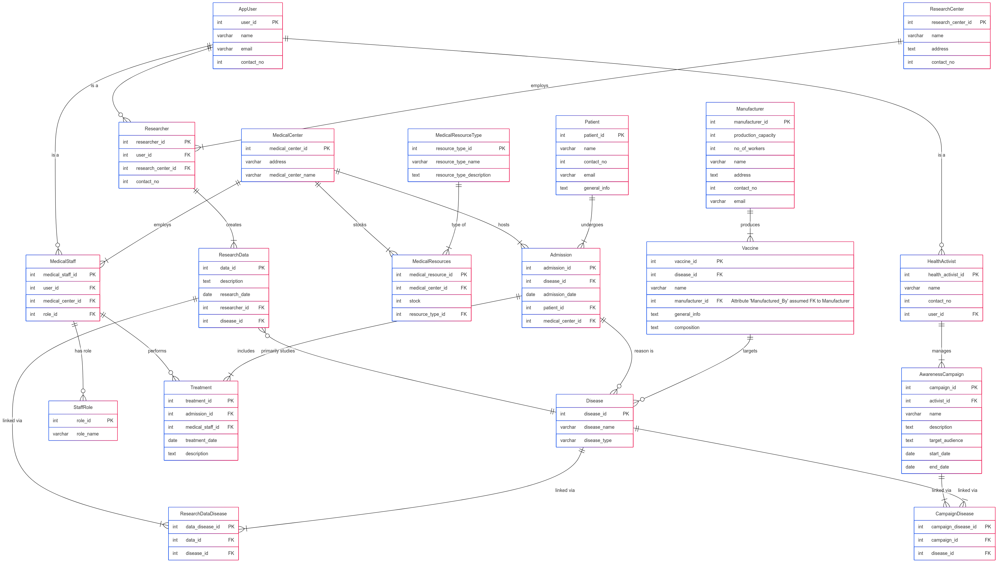
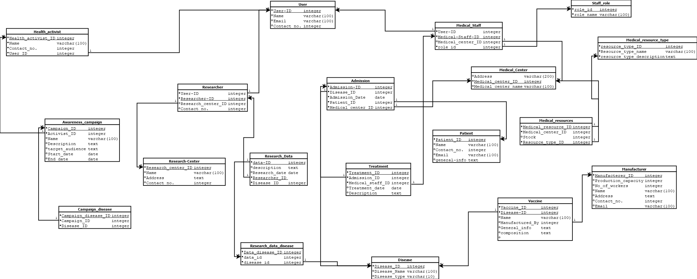

# 🏥 VISHWA: Vital Information System For Health Wellness and Awareness ✨

[](https://www.postgresql.org/)
<!-- Add other relevant badges if applicable, e.g., License -->
<!-- [](LICENSE.md) -->

---

## 🎯 Objective

We aim to improve global health care by creating a modern, data-based system that tracks diseases, makes the best use of health resources, and provides real-time health information. **VISHWA** gives doctors, health officials, and researchers the useful information they need to act quickly, focus on prevention, and protect public health worldwide.

## 🚀 Core Functionality

This database enables management of:

*   👤 **Users & Roles:** Defines users (Patients, Staff, Researchers, Activists) and their specific roles.
*   🏥 **Clinical Operations:** Tracks patient admissions, treatments, and associated diseases within medical centers.
*   🔬 **Research Activities:** Manages research data collection and links it to relevant diseases.
*   📢 **Awareness Campaigns:** Allows health activists to manage campaigns targeted at specific diseases or audiences.
*   📦 **Resources & Logistics:** Handles medical/research centers, resource types, stock levels, manufacturers, and vaccines.

## 📊 Database Diagrams

### Entity-Relationship Diagram (ERD)

*This diagram shows the high-level entities and their relationships.*



### Relational Schema

*This diagram details the specific tables, columns, primary keys (PK), and foreign keys (FK).*



---

## 👥 Team Members (Project Group No: 2 | Lab Group: 6)

*   **Akshat Bhatt** (Group Representative) - `202301460`
*   **Maheriya Harsh Prakashbhai** - `202301470`
*   **Nilesh Mori** - `202301473`

---

## 🛠️ Technology

*   **Database:** PostgreSQL 🐘

---

## ⚙️ Setup

1.  **Prerequisites:** Ensure PostgreSQL is installed and running.
2.  **Run DDL:** Connect to your PostgreSQL instance and execute the provided `commands.sql` script (referencing the DDL pages in the project documentation) to create the database structure.
    ```bash
    # Example command:
    psql -U your_username -d your_database_name -f commands.sql
    ```

---

*VISHWA aims to connect data for a healthier, more informed community.*
